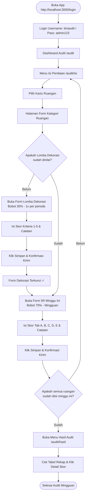

# 📋 Panduan & Tutorial Pengisian Penilaian 5R & Dekorasi — Tim Audit

Panduan ini berisi instruksi **lengkap, detail, dan berurutan (step-by-step)** mengenai pengisian Penilaian 5R dan Lomba Dekorasi pada aplikasi **TKI HUT RI ke-81**, dari tahap login, pemahaman dashboard, pengisian form kriteria, interaksi tombol/modal, hingga evaluasi hasil penilaian.

---

## 🔑 Informasi Akses & Kredensial

| Parameter | Keterangan |
|---|---|
| **URL Aplikasi** | [https://tki-hutri81.ka4.dev/login](https://tki-hutri81.ka4.dev/login) |
| **Username** | `timaudit` |
| **Password** | `admin123` |
| **Role / Hak Akses** | `Audit` — Tim Penilai Ruangan & Dekorasi |

---

## 📅 Aturan Pengisian Penilaian (Aturan Baku)

Sistem membagi penilaian menjadi 2 kelompok utama dengan frekuensi dan bobot yang berbeda:

```
┌─────────────────────────────────────────────────────────────────────────────┐
│                            TOTAL PENILAIAN RUANGAN                          │
├──────────────────────────────────────┬──────────────────────────────────────┤
│ 1. AUDIT BUDAYA 5R (Bobot 70%)        │ 2. LOMBA DEKORASI (Bobot 30%)        │
│ • Diisi SETIAP MINGGU                │ • Diisi SEKALl PER PERIODE           │
│ • Minggu ke-1, ke-2, dst.            │ • 1x per auditor per ruangan         │
└──────────────────────────────────────┴──────────────────────────────────────┘
```

| Jenis Penilaian | Frekuensi Pengisian | Bobot Nilai | Keterangan Operasional |
|---|---|---|---|
| **Audit Budaya 5R** | **Setiap minggu** (Mingguan) | **70%** | Wajib diisi ulang setiap minggu berjalan selama periode lomba. |
| **Lomba Dekorasi** | **Sekali seumur periode** | **30%** | Hanya diisi 1 kali per auditor per ruangan, berlaku untuk seluruh periode. |

> **💡 Definisi Ruangan "Lengkap ✓":**  
> Suatu ruangan dianggap **Lengkap ✓** oleh auditor jika ruangan tersebut sudah memiliki **1 isian Lomba Dekorasi** + **1 isian Audit 5R untuk minggu berjalan**.

---

## 📍 Step-by-Step Alur Pengisian & Screenshot Aplikasi

---

### STEP 1: Masuk ke Aplikasi (Login)

1. Buka peramban (browser) dan akses URL [http://localhost:3000/login](http://localhost:3000/login).
2. Isikan formulir login:
   - **Username**: `timaudit`
   - **Password**: `admin123`
3. Klik tombol **"Masuk"**.


*Sistem akan memverifikasi kredensial dan mengarahkan Anda ke Dashboard Audit secara otomatis.*

---

### STEP 2: Memahami Dashboard Audit (`/audit`)

Setelah login berhasil, Anda akan disambut oleh **Dashboard Audit**:


#### Komponen Utama Dashboard:
1. **Kartu Statistik KPI (Atas)**:
   - **Total Ruangan**: Jumlah seluruh area kerja yang wajib dinilai.
   - **Sudah Dinilai**: Jumlah ruangan yang telah berhasil Anda selesaikan.
   - **Rata-rata Skor**: Nilai gabungan dari seluruh audit yang disubmit.
2. **Banner Countdown Deadline**: Menampilkan sisa hari/jam sebelum periode penilaian ditutup.
3. **Kartu Ruangan & Status Cepat**: Menampilkan status tiap ruangan (Lengkap, Belum Lengkap, atau Belum kamu isi).

---

### STEP 3: Navigasi ke Halaman Isi Penilaian (`/audit/isi`)

Klik menu **"Isi Penilaian"** pada bar navigasi kiri untuk masuk ke pusat pengisian audit.


#### Fitur & Tombol yang Tersedia di Halaman Ini:
- **Bar Progres Penilaianmu**: Menampilkan progres *real-time* (contoh: `5R: 0/5 Ruangan` dan `Dekorasi: 0/5 Ruangan`).
- **Tab Filter Ruangan**:
  - `Semua (5)` — Menampilkan seluruh ruangan.
  - `Belum Kamu Isi` — Menyaring khusus ruangan yang masih memerlukan penilaian Anda.
  - `Sudah Kamu Isi ✓` — Menyaring ruangan yang telah selesai Anda nilai.
- **Tombol "Petunjuk Penilaian"**: Membuka modal petunjuk teknis 5R & Dekorasi.
- **Tombol "Riwayat Log"**: Membuka modal log pengisian aktivitas audit mingguan.

---

### STEP 4: Menggunakan Tombol Bantuan & Log (Modal Interactive)

#### A. Modal Petunjuk Penilaian
Apabila Anda membutuhkan panduan standar operasional penilaian, klik tombol **"Petunjuk Penilaian"** di pojok kanan atas.


*Modal ini memuat definisi ringkas 5R (Ringkas, Rapi, Resik, Rawat, Rajin), skala nilai 1–5, serta bobot persentase Lomba Dekorasi (30%) dan Audit 5R (70%). Klik ikon `X` atau area luar untuk menutup modal.*

#### B. Modal Riwayat Log Mingguan
Untuk melihat seluruh audit yang sudah pernah Anda kirimkan minggu ini, klik tombol **"Riwayat Log"**.


*Modal ini menampilkan riwayat pengisian per ruangan beserta tanggal/waktu submit, skor total, dan status.*

---

### STEP 5: Memilih Ruangan & Menentukan Form Kategori

1. Dari daftar ruangan di `/audit/isi`, klik pada kartu ruangan yang ingin Anda nilai (misalnya: **CS & Implementator**).
2. Halaman akan menampilkan **Daftar Kategori Form** untuk ruangan tersebut:


Halaman ini terbagi menjadi 2 seksi form:
1. **SEKSI 1: LOMBA DEKORASI RUANGAN (Bobot 30%)**  
   - Menampilkan form *Lomba Dekorasi*.
   - Hanya perlu diisi **1x selama periode**.
2. **SEKSI 2: AUDIT BUDAYA 5R (Bobot 70%)**  
   - Ditampilkan dalam format accordion per minggu (misal: *Minggu ke-1* dengan tag **"Minggu Ini"**).
   - Menampilkan form spesifik tipe ruangan (contoh: *Office Non-Smoking*, *Office Smoking*, atau *Production Area*).

---

### STEP 6: Pengisian Form Penilaian 5R & Lomba Dekorasi

Klik pada nama form yang ingin diisi (misalnya: **Office Smoking** atau **Lomba Dekorasi**).


#### Cara Pengisian Form Penilaian:
1. **Navigasi Kategori (Tab A, B, C, D, E)**:  
   Gunakan tombol pill di bagian atas untuk berpindah antar aspek (A: Ringkas, B: Rapi, C: Resik, D: Rawat, E: Rajin).
2. **Pemberian Skor (Pilihan 1 – 5)**:  
   Klik salah satu tombol angka pada setiap poin kriteria:
   - **1** = Tidak Ada / Sangat Buruk
   - **2** = Sangat Kurang
   - **3** = Cukup / Kurang
   - **4** = Baik
   - **5** = Sangat Baik
3. **Catatan Temuan (Opsional)**:  
   Tuliskan catatan/rekomendasi pada kolom teks yang disediakan di bawah kriteria jika ditemukan hal khusus.
4. **Indikator Progres**:  
   Bilah progres di bagian atas akan bertambah seiring Anda mengisi kriteria.
5. **Tombol "Simpan Penilaian"**:  
   Setelah seluruh kriteria terisi, klik tombol **"Simpan Penilaian"** di bagian bawah.

#### Dialog Konfirmasi Penilaian:
Setelah tombol Simpan diklik, sistem akan menampilkan **Dialog Popup Konfirmasi Rangkuman**:
- Memeriksa kelengkapan seluruh poin.
- Menampilkan skor total yang dihitung.
- Klik **"Kirim Penilaian"** untuk memfinalisasi pengisian.

---

### STEP 7: Status Terkunci Setelah Submit & Pembaharuan Progres

#### A. Status Form Terkunci
Setelah form Lomba Dekorasi disubmit, tombol form tersebut otomatis berubah menjadi ber-badge hijau **"Sudah Kamu Nilai ✓"** dan terkunci (*disabled*), mencegah pengisian ganda.


Begitu pula saat form 5R disubmit, log aktivitas ruangan akan langsung memperbarui jumlah total form terisi:


#### B. Progres Ruangan di Halaman Utama (`/audit/isi`)
Apabila Anda kembali ke halaman daftar ruangan, Anda akan melihat progres akun Anda telah bertambah (misalnya: `5R: 1/5 Ruangan`, `Dekorasi: 1/5 Ruangan`), dan kartu ruangan terkait menampilkan status **"Sudah Kamu Isi (1)"**:


---

### STEP 8: Memantau Hasil Audit & Log Penilaian (`/audit/hasil`)

Navigasi ke menu **"Hasil Audit"** pada sidebar untuk melihat rekapitulasi seluruh nilai yang telah masuk ke sistem.


#### Elemen Pada Halaman Hasil Audit:
- **Tabel Rekapituasi Log**: Menampilkan daftar submission berdasarkan tanggal, ruangan, auditor, tipe form, dan skor akhir.
- **Kategori Badge Warna Skor**:
  - 🟢 **Hijau (Skor ≥ 80)**: Sangat Baik / Lolos Standard.
  - 🟡 **Kuning (Skor 60 – 79)**: Cukup / Perlu Perhatian.
  - 🔴 **Merah (Skor < 60)**: Kurang / Perlu Perbaikan Segera.
- **Kotak Pencarian & Filter**: Memudahkan pencarian berdasarkan nama ruangan atau tanggal audit.

---

### STEP 9: Melihat Pop-up Detail Rincian Skor

Untuk melihat transparansi rincian nilai per kriteria dari suatu submission:
1. Klik tombol **"Detail"** (atau ikon panah/baris tabel) pada baris yang ingin diperiksa.
2. Pop-up **Modal Detail Rincian Skor** akan terbuka:


#### Informasi di Dalam Modal Detail:
- Nama Ruangan, Tanggal Audit, dan Nama Auditor.
- Skor Akhir Total & Badge Kategori.
- Breakdown Nilai per Aspek (Ringkas, Rapi, Resik, Rawat, Rajin, atau Kriteria Dekorasi).
- Catatan temuan khusus saat penilaian lapangan.
- Klik tombol **"Tutup"** untuk kembali ke halaman tabel hasil.

---

## 🔄 Mermaid Diagram Alur Penilaian Tim Audit



---

## 💡 Rangkuman 5 Poin Penting untuk Tim Audit

1. **Frekuensi Isian**: Lomba Dekorasi hanya perlu diisi **1 kali** seumur periode perlombaan, sedangkan Audit 5R wajib diisi **setiap minggu**.
2. **Kunci Otomatis**: Form yang sudah disubmit akan otomatis terkunci demi integritas data dan mencegah overwrite tidak sengaja.
3. **Auto-Save Draft**: Jika browser tertutup secara tidak sengaja saat mengisi form, isian sementara tersimpan otomatis sebagai draft (terikat pada minggu berjalan).
4. **Pengisian Mandiri Setiap Auditor**: Setiap auditor mengisi dan memiliki riwayat pengisian masing-masing untuk ruangan yang sama.
5. **Transparansi Nilai**: Seluruh rincian per poin kriteria dapat diperiksa kembali kapan saja pada menu **Hasil Audit** (`/audit/hasil`).

---

*Dokumen ini disusun sebagai Panduan Resmi Penggunaan Sistem Audit TKI HUT RI ke-81.*
